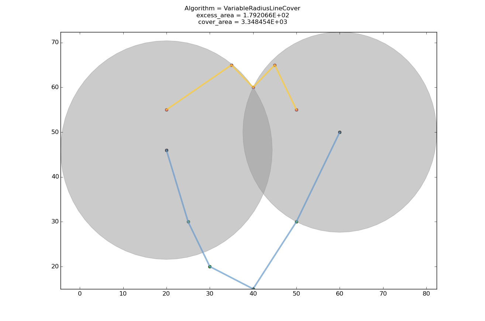
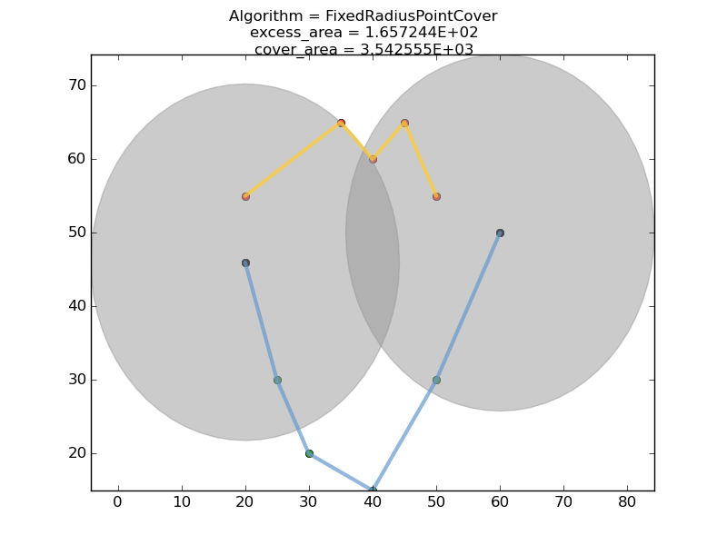
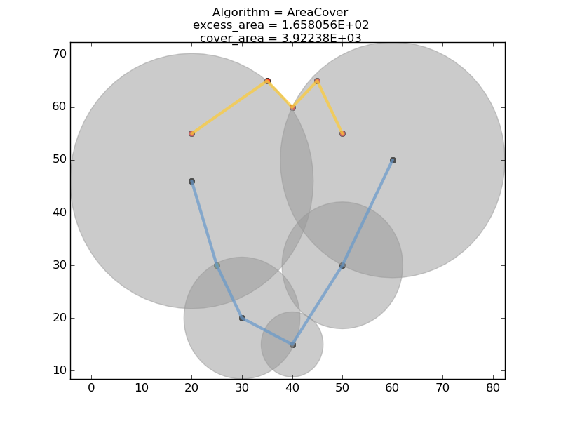

## Geometric Circle-cover

Minimum circle cover from a set of center points covering a set of lines. 

This package consists of three circle cover algorithms:

### Variable radius edge cover:

Given a set of M points on a plane where circles can be centered and
a set of N line segments which need to be covered by the circles,
find the minimum area circle cover for the line segments. That is,
find the radii of the circles and the centers (chosen from the M points)
such that all the N line segments are covered and the total area of the
circles is minimized. For example:

Note that a line segment is covered if no part of it is OUTSIDE a circle.

### Fixed  radius point cover:
Given a set of M points on a plane where circles can be centered and
a set of N Points which need to be covered by the circles,
find the minimum area circle cover for the points. That is,
find the fixed radius of the circles and the centers (chosen from the M points)
such that all the N points are covered and the total area of the
circles is minimized. For example:

Note that a point covered if it is within a circle.

### Variable  radius area cover:

Given a set of M points on a plane where circles can be centered and
a set of N lines, construct a polygon including the M points and N lines.
find the minimum area circle cover for the polygon. That is
find the radii of the circles and the centers (chosen from the M points)
such that all the polygon thus defined is covered and the area
circles is minimized. For example:

Note that an area is covered if it is within atleast one circle.

The target application for this code is ESC sensor placement and sensitivity
tuning for 3.5 GHZ spectrum sharing.

A matlab wrapper for the main python functionality is included.

## Installing the code

### Prerequisites

Install Shapley Package 

For Linux:

    pip install shapely

For windows: Download the shapley installer for your architecture:

    http://www.lfd.uci.edu/~gohlke/pythonlibs/#shapely

Run pip install on the downloaded .whl file.

### Installation 

Now (for both Linux and Windows) run setup for the current package:

    python setup.py install

## USAGE
### Python

See circlecover/test

### MATLAB

Add the circlecover directory to your matlab path.

See the documentation help min\_cover for usage.

See the example in circlecover/test/CircleCoverTest.m

    esc_loc_x = [1771380,1769310,1769790,1768380,176739,1764690,...
        1762020,1759920,1753110,1741950,1752210,1757010,1761870,...
        1768230,1772820,1777110,1781610,1786920,1793220];

    esc_loc_y = [1827030,1817070,1806990,1797090,1787100,1776840,...
        1767270,1756950,1746690,1735050,1727220,1717290,1707360,...
        1697370,1687320,1677450,1667400,1657350,1647360];

    ic_x = [1847012,1844913,1845660,1834150,1823280,1811715,...
        1807512,1806671,1810710,1807769,1817910,1822503,1827218,...
        1823623,1828432,1842183,1846928,1852378,1858591];

    ic_y = [1843636,1833617,1823583,1811442,1799284,1787072,1777140,...
        1767066,1759078,1749183,1741311,1731358,1721401,1709309,...
        1699318,1691518,1681523,1671542,1661589];

    esc_loc = [esc_loc_x',esc_loc_y'];

    ic = [ic_x',ic_y'];

    distance = 60;

    [centers_x,centers_y,radius] = min_cover(esc_loc,ic,distance);

    disp('centers_x');
    disp(centers_x);
    disp('centers_y');
    disp(centers_y);
    disp('radius');
    disp(radius);

## Disclaimers

This software was developed by employees of the National Institute
of Standards and Technology (NIST), an agency of the Federal
Government. Pursuant to title 17 United States Code Section 105, works
of NIST employees are not subject to copyright protection in the United
States and are considered to be in the public domain. Permission to freely
use, copy, modify, and distribute this software and its documentation
without fee is hereby granted, provided that this notice and disclaimer
of warranty appears in all copies.

THE SOFTWARE IS PROVIDED 'AS IS' WITHOUT ANY WARRANTY OF ANY KIND,
EITHER EXPRESSED, IMPLIED, OR STATUTORY, INCLUDING, BUT NOT LIMITED
TO, ANY WARRANTY THAT THE SOFTWARE WILL CONFORM TO SPECIFICATIONS, ANY
IMPLIED WARRANTIES OF MERCHANTABILITY, FITNESS FOR A PARTICULAR PURPOSE,
AND FREEDOM FROM INFRINGEMENT, AND ANY WARRANTY THAT THE DOCUMENTATION
WILL CONFORM TO THE SOFTWARE, OR ANY WARRANTY THAT THE SOFTWARE WILL BE
ERROR FREE. IN NO EVENT SHALL NASA BE LIABLE FOR ANY DAMAGES, INCLUDING,
BUT NOT LIMITED TO, DIRECT, INDIRECT, SPECIAL OR CONSEQUENTIAL DAMAGES,
ARISING OUT OF, RESULTING FROM, OR IN ANY WAY CONNECTED WITH THIS
SOFTWARE, WHETHER OR NOT BASED UPON WARRANTY, CONTRACT, TORT, OR
OTHERWISE, WHETHER OR NOT INJURY WAS SUSTAINED BY PERSONS OR PROPERTY
OR OTHERWISE, AND WHETHER OR NOT LOSS WAS SUSTAINED FROM, OR AROSE OUT
OF THE RESULTS OF, OR USE OF, THE SOFTWARE OR SERVICES PROVIDED HEREUNDER.

Distributions of NIST software should also include copyright and licensing
statements of any third-party software that are legally bundled with
the code in compliance with the conditions of those licenses.

Acknowledgement
===============

-- The variable radius cover algorithms implemented here were suggested by Stefan Haustein see:

	http://stackoverflow.com/questions/40748412/minimun-area-geometric-cover-for-a-set-of-line-segments

    (with modifications)

-- The criterion of minimum excess area circle cover was proposed by Tim Hall. 

-- Improvements to the algorithm were evolved and bad ideas pruned as
   a result of discussions with Anastase Nakassis at NIST.
   Tassos provided counter examples and corner cases to rule out
   earlier versions of the algorithm. 

-- This algorithm was developed for placement of and clibration of ESC
   sensors for 3.5 GHz spectrum sharing but it is generally applicable 
   for geometric line cover.

-- The fixed disc point cover algorithm was suggested in the paper

    3.5 GHz Environmental Sensing Capability Sensitivity Requirements and Deployment
    Thao T. Nguyen, Anirudha Sahoo, Michael R. Souryal, and Timothy A. Hall
    Communications Technology Laboratory
    National Institute of Standards and Technology
    Gaithersburg, Maryland, U.S.
    Email: fttn1,ans9,souryal,tim.hallg@nist.gov

    DySpan 2017, Baltimore, MD

Future Work
==========

TBD

