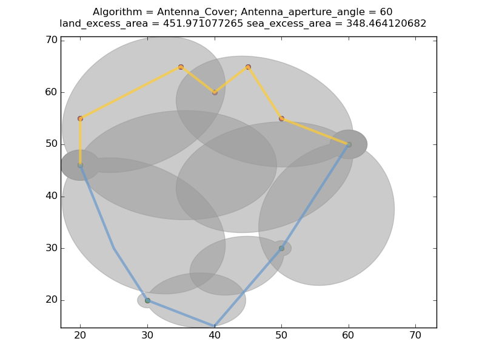
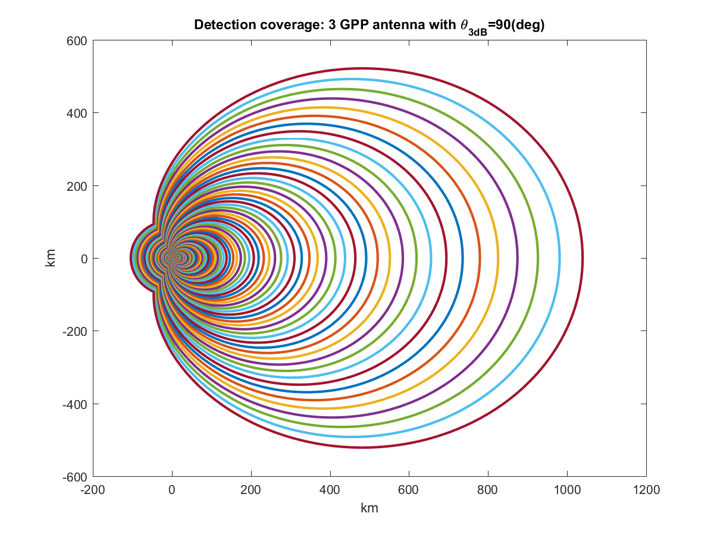
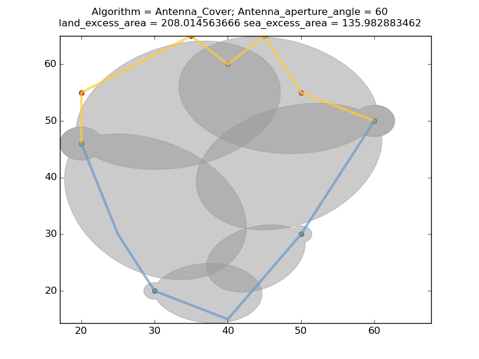

## Geometric Circle-cover

Greedy minimum cover from a set of center points covering a region. 

### Fixed radius point cover:

Scenario: Cover a set of critical points (AKA) knot points with sensors having identical isotropic antennas. Determine the following:

- Placement of the sensors.
- Calibration of the antennas (i.e. "optimum" detection radius. Note that in this case we assume
    all antennas have the same detection radius).

Absract problem statement:

Given a set of M points on a plane where circles can be centered and
a set of N Points which need to be covered by the circles,
find the minimum area circle cover for the points. That is,
find the fixed radius of the circles and the centers (chosen from the M points)
such that all the N points are covered and the total area of the
circles is minimized. For example:

Note that a point covered if it is within a circle.

### Variable radius edge cover:

Scenario: Cover a set of edges with sensors having isotropic antennas of variable sensitivity. Determine the following:

- Placement of the sensors.
- Antenna calibration.
    (i.e. determine their "optimum" detection radius at each location where they are placed.)

Absract problem statement:

Given a set of M points on a plane where circles can be centered and
a set of N line segments which need to be covered by the circles,
find the minimum area circle cover for the line segments. That is,
find the radii of the circles and the centers (chosen from the M points)
such that all the N line segments are covered and the total area of the
circles is minimized. For example:

Note that a line segment is covered if no part of it is OUTSIDE a circle.

### Variable  radius area cover:

Scenario: Cover an area with with sensors having isotropic antennas of variable sensitivity. Determine the following:

- Placement of the sensors.
- Calibration of the antennas
    (i.e. determine their "optimum" detection radius at each location where they are placed)

Abstract problem statement:

Given a set of M points on a plane where circles can be centered and
a set of N lines, construct a polygon including the M points and N lines.
find the minimum area circle cover for the polygon. That is
find the radii of the circles and the centers (chosen from the M points)
such that all the polygon thus defined is covered and the area
circles is minimized. For example:

Note that an area is covered if it is within atleast one circle.

### Variable Radius Antenna Cover:

Scenario: Cover an area given are with a set of sensors, each of which has multiple antennas all of the same 
antenna aperture angle but with different sensitivities. Determine the following:

- Placement of the sensors.
- Orientation of the antennas (i.e. azimuth angle w.r.t. the horizontal).
- Calibration of the antennas (i.e. "optimum" detection range of the antennas at each location where they are placed).

Abstract problem statement:

Given a set of M points on a plane where multi-antenna sensors can
be centered and a set of N lines defining an interference contour,
construct a polygon including the M points and N lines.  Find the minimum
area antenna cover for the polygon. That is find the azimuth angle and
sensitivity of the antennas placed on a subset of the M points such
that the area of the polygon to be covered is entirely covered and the
excess area of the cover is minimized. 

Here is an example of a test run:

Note that each antenna has the same beam width (60 degrees in the diagram
above). The covers are chosen from a family of "concentric" coverage
curves that are generated off line using an appropriate propagation model
(i.e. Free Space, Hata etc.) shown below is the pattern for free space
propagation loss:

The antenna cover may be imporoved after minimizing the excess area and removing redundant lobes. This is achieved through 
simulated annealing.  We allow a small amount of "slop"
(e.g. .05% of area can remain uncovered).The results are shown below:

A matlab wrapper for the main python functionality is included.
The target application for this code is ESC sensor placement and sensitivity
tuning for 3.5 GHZ spectrum sharing.

## Installing the code

### Prerequisites

Install Shapley Package 

For windows: 

-- Download the shapley installer for your architecture:

   http://www.lfd.uci.edu/~gohlke/pythonlibs/#shapely
	
   Run pip install on the downloaded .whl file.

-- Download and install matplotlib and numpy:

http://www.scipy.org/install.html

### Installation 

Now (for both Linux and Windows) run setup for the current package:

    python setup.py install

    ( this will also install all dependencies 
     - i.e. numpy, shapely  and matplotlib for Linux,
     and put everything where your python interpreter can find it)

## USAGE
### Python

See circlecover/test

### MATLAB

Add the circle-cover/circlecover directory to your matlab path.

See the documentation help min\_isotropic\_area\_cover for usage.

##### Example 1: 

Min area circle cover (isotropic antenna) invoked from MATLAB:

See the example in circlecover/test/CircleCoverTest.m :

    esc_loc_x = [1771380,1769310,1769790,1768380,176739,1764690,...
        1762020,1759920,1753110,1741950,1752210,1757010,1761870,...
        1768230,1772820,1777110,1781610,1786920,1793220];

    esc_loc_y = [1827030,1817070,1806990,1797090,1787100,1776840,...
        1767270,1756950,1746690,1735050,1727220,1717290,1707360,...
        1697370,1687320,1677450,1667400,1657350,1647360];

    ic_x = [1847012,1844913,1845660,1834150,1823280,1811715,...
        1807512,1806671,1810710,1807769,1817910,1822503,1827218,...
        1823623,1828432,1842183,1846928,1852378,1858591];

    ic_y = [1843636,1833617,1823583,1811442,1799284,1787072,1777140,...
        1767066,1759078,1749183,1741311,1731358,1721401,1709309,...
        1699318,1691518,1681523,1671542,1661589];

    esc_loc = [esc_loc_x',esc_loc_y'];

    ic = [ic_x',ic_y'];

    distance = 60;

    [centers_x,centers_y,radius] = min_isotropic_area_cover(esc_loc,ic,distance);

    disp('centers_x');
    disp(centers_x);
    disp('centers_y');
    disp(centers_y);
    disp('radius');
    disp(radius);

### COMMAND LINE INTERFACE

A command line interface to run the antenna cover and circle cover algorithms is provided. Here is an invocation example:

    python compute_cover.py -pr test/InterfContour_WestCoast.txt -ap test/DetectionCoverage_60deg.txt -of WestCoast -dist 0

The tool takes as inputs a detection coverage file and protection region (area bounded by interference boundary and shore).
The output of this tool is a text file which may be read into matlab. 

    center_x [ center x coordinates of the antennas ]
    center_y [ center y coordinates of the antennas ]
    indexes  [ indentifiers of the antenna lobes presented in DetectionCoverage ]
    angles   [ azimuth orientations of the antenna lobes ]
    sensor_loc_x [ sensor x coordinates ]
    sensor_loc_y [ sensor y coordinates ]
    sensor_count  
    sea_excess_area
    land_excess_area

This information is also presented in a json file.

## Disclaimers

This software was developed by employees of the National Institute
of Standards and Technology (NIST), an agency of the Federal
Government. Pursuant to title 17 United States Code Section 105, works
of NIST employees are not subject to copyright protection in the United
States and are considered to be in the public domain. Permission to freely
use, copy, modify, and distribute this software and its documentation
without fee is hereby granted, provided that this notice and disclaimer
of warranty appears in all copies.

THE SOFTWARE IS PROVIDED 'AS IS' WITHOUT ANY WARRANTY OF ANY KIND,
EITHER EXPRESSED, IMPLIED, OR STATUTORY, INCLUDING, BUT NOT LIMITED
TO, ANY WARRANTY THAT THE SOFTWARE WILL CONFORM TO SPECIFICATIONS, ANY
IMPLIED WARRANTIES OF MERCHANTABILITY, FITNESS FOR A PARTICULAR PURPOSE,
AND FREEDOM FROM INFRINGEMENT, AND ANY WARRANTY THAT THE DOCUMENTATION
WILL CONFORM TO THE SOFTWARE, OR ANY WARRANTY THAT THE SOFTWARE WILL BE
ERROR FREE. IN NO EVENT SHALL NIST BE LIABLE FOR ANY DAMAGES, INCLUDING,
BUT NOT LIMITED TO, DIRECT, INDIRECT, SPECIAL OR CONSEQUENTIAL DAMAGES,
ARISING OUT OF, RESULTING FROM, OR IN ANY WAY CONNECTED WITH THIS
SOFTWARE, WHETHER OR NOT BASED UPON WARRANTY, CONTRACT, TORT, OR
OTHERWISE, WHETHER OR NOT INJURY WAS SUSTAINED BY PERSONS OR PROPERTY
OR OTHERWISE, AND WHETHER OR NOT LOSS WAS SUSTAINED FROM, OR AROSE OUT
OF THE RESULTS OF, OR USE OF, THE SOFTWARE OR SERVICES PROVIDED HEREUNDER.

Distributions of NIST software should also include copyright and licensing
statements of any third-party software that are legally bundled with
the code in compliance with the conditions of those licenses.

Acknowledgement
===============

-- The variable radius cover algorithms implemented here were suggested by Stefan Haustein see:

	http://stackoverflow.com/questions/40748412/minimun-area-geometric-cover-for-a-set-of-line-segments

    (with modifications)

-- The criterion of minimum excess area circle cover was proposed by Tim Hall. 

-- Improvements to the algorithm were evolved and bad ideas pruned as
   a result of discussions with Anastase Nakassis at NIST.
   Tassos provided counter examples and corner cases to rule out
   earlier versions of the algorithm. 

-- This algorithm was developed for placement of and clibration of ESC
   sensors for 3.5 GHz spectrum sharing but it is generally applicable 
   for geometric cover.

-- The fixed disc point cover algorithm was suggested in the paper

    3.5 GHz Environmental Sensing Capability Sensitivity Requirements and Deployment
    Thao T. Nguyen, Anirudha Sahoo, Michael R. Souryal, and Timothy A. Hall
    Communications Technology Laboratory
    National Institute of Standards and Technology
    Gaithersburg, Maryland, U.S.
    Email: fttn1,ans9,souryal,tim.hallg@nist.gov

    DySpan 2017, Baltimore, MD

Future Work
==========

TBD

